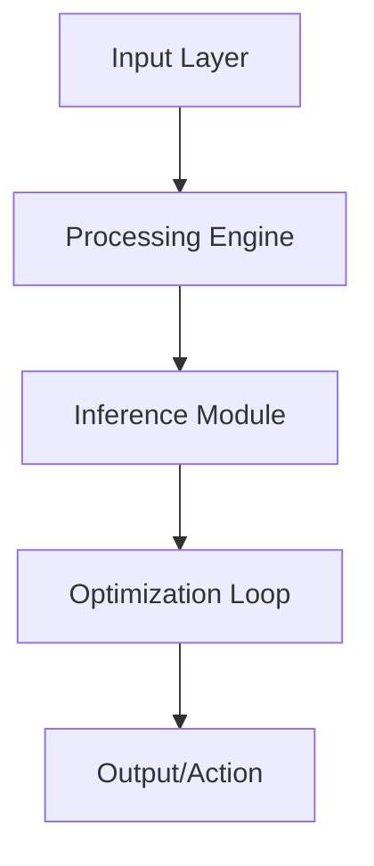

# 🤖 Deep RL Simulation

[](LICENSE)
[](https://www.python.org/)
[](#)

High-fidelity simulation environment for training complex reinforcement learning agents.

## 🏗️ Architecture



## 🌟 Key Features
- **Parallel Environment Execution**
- **Custom Reward Shaping API**
- **Sensor-fused Observation Space**

## 🛠️ Technology Stack
- `Gymnasium`
- `Stable Baselines3`
- `MuJoCo`
- `PyBullet`

## 🚀 Installation

```bash
git clone https://github.com/YannLeCun25/deep-rl-simulation.git
cd deep-rl-simulation
pip install -r requirements.txt
```

## 📂 Project Structure
```
├── src/            # Modular source code
├── tests/          # Unit & integration tests
├── docs/           # Technical documentation
├── requirements.txt # Dependency list
└── setup.py        # Package installation
```

Developed by **Yann LeCun** (Elite AI Engineer).
